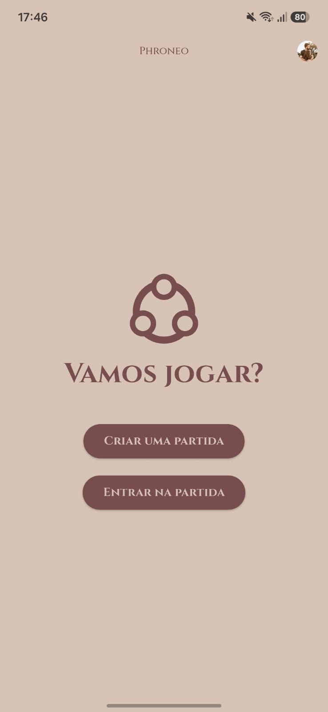
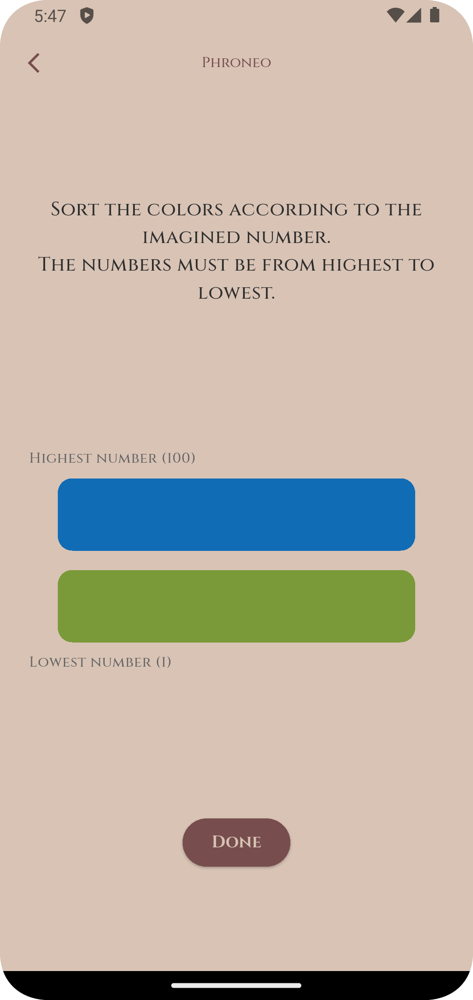
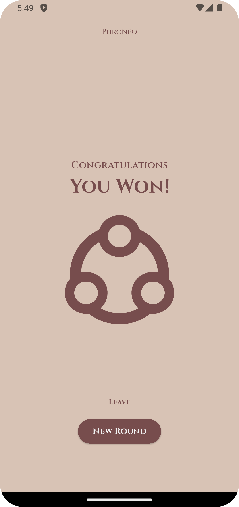

# Phroneo

This app was developed to be an engaging and interactive multiplayer mobile game.

In this project, I put into practice my knowledge of modern cross-platform development using **Flutter** and **Dart**, applying concepts such as Reactive UI, Dependency Injection, State Management with Controllers (ChangeNotifier), Firebase Firestore for real-time multiplayer syncing, and robust navigation using GoRouter.

## Screenshots

<p align="center">
  
  
  
  
  
</p>

---

## Overview

The application enables users to:

- Create unique game rooms and act as a Host.
- Join existing matches easily via generated Room Codes or scanning QR Codes.
- Interact in real-time during game rounds (guessing secret numbers, phrases, etc.).
- See immediate state updates synced across all players' devices.

The project was built to demonstrate modern Flutter architecture, following clean architecture principles, separation of concerns, and best practices for scalability and maintainability.

---

## Authentication & Database

This project uses **Firebase Authentication** to grant easy and secure access to users.
For the core gameplay, it relies on **Firebase Firestore** to provide real-time, low-latency synchronization of the match state between the Host and the players.

---

## Tech Stack

Main technologies and architectural concepts used in this project:

- **Dart & Flutter**: Core framework.
- **State Management**: `ChangeNotifier` / `ListenableBuilder` (Native reactive state).
- **Navigation**: `go_router` for deep linking and declarative routing.
- **Dependency Injection**: `get_it` for decoupling services and controllers.
- **Backend & Real-time Database**: Firebase (Auth & Firestore).
- **Crash Reporting**: Firebase Crashlytics.

Key Flutter packages used:

- `qr_flutter` (For generating room QR Codes)
- `mobile_scanner` (For scanning QR Codes to join rooms)
- `nanoid2` (For secure unique room code generation)

---

## Project Structure

The project is organized by features (Feature-First Architecture) to maintain decoupling:

```text
lib/
├── core/
│   ├── constants/
│   ├── router/          # go_router configuration (AppRoutes)
│   ├── theme/           # App colors, text styles, etc.
│   └── widgets/         # Shared UI components (e.g., CustomAppBar)
├── features/
│   ├── game/            # Game logic, PhrasePage, NumberPage
│   └── home/            # Match creation, MatchController, Dashboard
└── main.dart            # App entry point & Firebase initialization